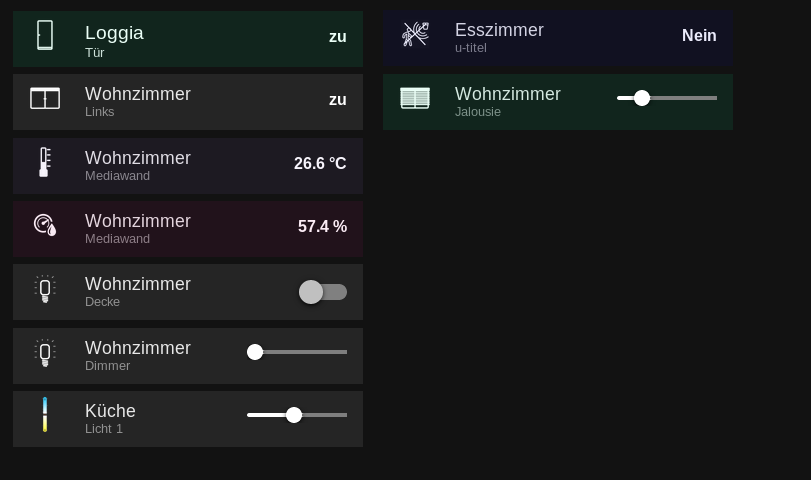

# ioBroker.vis-material-advanced
This Adapter provides standardized Widgets for vis in ioBroker. Lots of different predifined widgets :)
============

  

material-advanced - Advanced Material widgets for ioBroker.vis.

This Adapter has been originally forked from ioBroker.vis-material started by nisio.

Due to very huge changes and no response from my puu Request ( https://github.com/iobroker-community-adapters/ioBroker.vis-material/pull/18 ) and still lots of Ideas for this Adapter I decided to create a new Adapter to enable delivery to the latest Repository.

I have kept the version numbers created in the fork to show the changes made in past. ( also thanks to pix ).

You can read instructions in material.js, material.html files

These widgets are in addition to the material design style of Uhula, which you can find here:
https://github.com/Uhula/ioBroker-Material-Design-Style

## Changelog

### 0.4.0
- (EdgarM73) added colorize Effect to Temperature and Humidity Widget and option to define the values when to colorize
             created new adapter to be independently from pull requests

### 0.3.0
- (EdgarM73) WindowShutter Widget has been re-created due to unknown error. Old widget is most likey not working anymore.
             New Color Temperature Widget ( Kelvin ) has been created
             new widgets placed are now standard 350px instead of 100% which made no sense ;)
             minor bugfixes and refactoring
             
### 0.2.0
- (EdgarM73) widgets are now customizable, text-color, icon, color of overlay

### 0.1.8
- (EdgarM73) renamed css classes due to incompatibility with Uhula Material Design Schema

### 0.1.7
- (EdgarM73) dark material button alike

### 0.1.6 (2020-07-12)
- (EdgarM73) feat: new Occupancy widget

### 0.1.5 (2018-07-11)
- (pix) feat: new window shutter widget

### 0.1.4 (2018-07-10)
- (pix) feat: new humidity widget

### 0.1.3 (2018-01-21)
- (nisio) feat: new dimmer widget

### 0.1.2 (2018-01-20)
- (nisio) feat: switch added to light widget

### 0.1.1 (2018-01-14)
- (nisio) feat: temperature and light widget

### 0.1.0 (2018-01-13)
- (nisio) Initial version for public testing (includes css from material design styles V1.8)

### 0.0.1 (2018-01-01)
- (nisio) Initial version for internal testing

## License
 Copyright (c) 2018-2018 nisiode
 MIT
